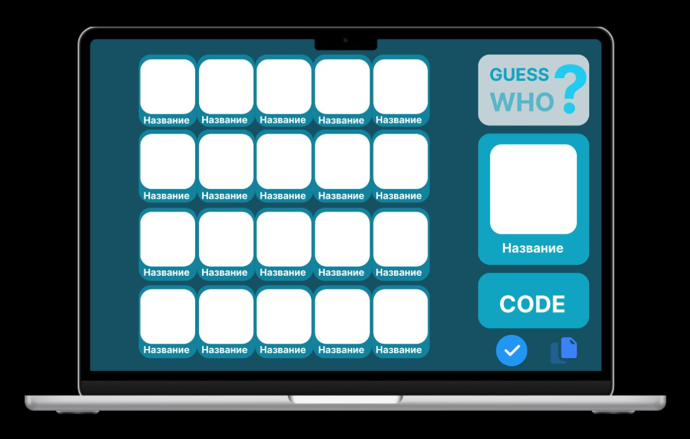
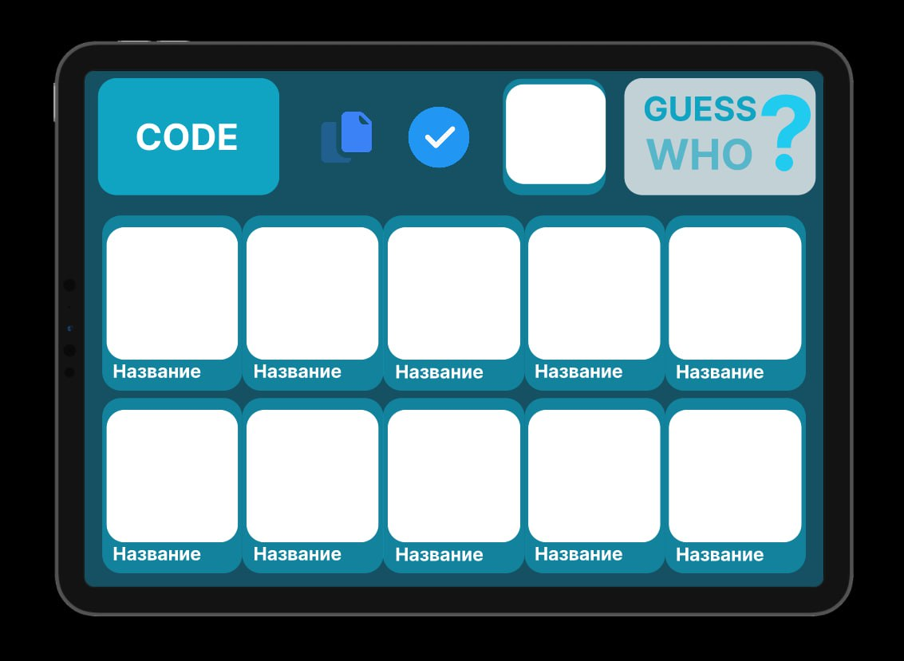
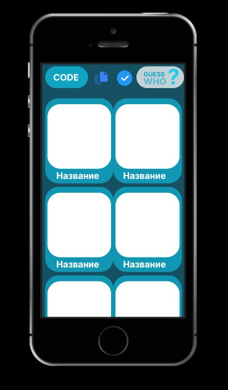

# Associations Game

This project is realization of associations game, where the main aim of the player is to guess, which card is selected by co-player.
Here will be used React with raw HTML.

## Mock Up

## Functionality

- Select set of pictures
Players can select which set will be used in current game.
- Select result card
At the end of the game player chooses, which card, in his opinion, is guessed by another player.
- Cross out card
Player can cross out cards, which, in his opinion, wouldn't be right answer.
- Create own play room
- Join an existing play room
Player can create his own game or join existing by unique code

## Data Models

- Game
  * user_1 select
  * user_2 select
  * image_set
  * user_1
  * user_2
- User
  * gmail
  * name
